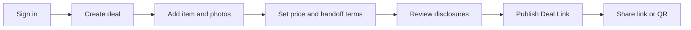
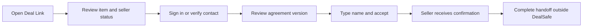
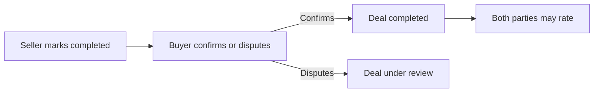

# DealSafe MVP — editable product brief

## Product promise

**Create a clear, shareable record of a private sale in under three minutes.**

The MVP is a trust record, not a marketplace and not an escrow provider. A seller creates a Deal Link, the buyer reviews the item and terms, both parties confirm their identity status and consent, and DealSafe preserves an auditable agreement record.

## Initial customer and category

- Beachhead: US peer-to-peer sellers of used iPhones and similar electronics
- Acquisition surface: Facebook Marketplace, Craigslist, Instagram, WhatsApp, and direct referrals
- Primary job: reduce ambiguity and capture evidence before an in-person or shipped transaction
- North-star metric: completed agreements with both parties confirmed

## MVP feature scope

| Capability | MVP behavior | Deliberately deferred |
|---|---|---|
| Deal Link | Unique public URL, item details, photos, price, terms, status | Custom domains, marketplace embeds |
| Verification | Email/phone confirmation plus honest “verification pending” provider slot | In-house KYC, background checks |
| Agreement | Versioned terms snapshot, typed-name consent, timestamp, IP/user-agent evidence fields | Qualified e-signature in every jurisdiction |
| Ratings | One rating per participant after completion | Portable reputation score and fraud adjudication |
| Risk | User safety checklist and disclosure flags | AI fraud score or definitive fraud claims |
| Admin | Basic report/review queue in the schema | Automated case management |

## Roles and permissions

- Seller: create/edit a draft, publish it, invite a buyer, mark handoff complete, rate buyer.
- Buyer: view a published link, identify themselves, accept the exact agreement version, rate seller.
- Admin: review reports, suspend abusive accounts or links, inspect an audit trail.
- Visitor: view only public, published deal fields; never sees private contact or evidence data.

## User flows

### Seller creates and shares

### Buyer accepts

### Completion and ratings

## Agreement and evidence model

Every acceptance points to an immutable `agreement_version`. Editing material terms creates a new version and invalidates prior pending acceptance. Evidence records store event type, actor, time, and request metadata. Sensitive identity documents should remain with the verification provider; DealSafe stores only the provider reference and result.

Suggested agreement sections: parties; item and serial/IMEI disclosure; price; payment method (informational only); delivery/handoff; condition and defects; inspection opportunity; cancellation; prohibited goods; dispute contact; consent and privacy notice.

## Success metrics for the first 90 days

- 100 seller interviews; 30 observed transactions
- 200 published Deal Links
- At least 35% link-to-buyer-acceptance conversion
- Median creation time under 3 minutes
- At least 25% of sellers create a second deal within 60 days
- Fewer than 5% support-contact rate caused by unclear product behavior

## Non-functional requirements

- Mobile-first WCAG 2.2 AA interface
- Public pages load in under 2.5 seconds on average mobile connections
- Encryption in transit and at rest; no raw identity documents in the app database
- Audit events append-only for agreement and status changes
- Daily backups, error monitoring, rate limiting, and abuse reporting
- Data retention and deletion policy defined before public beta

## Key risks and mitigations

- False sense of safety: never label a person “safe”; show verified facts and limitations.
- Regulatory scope creep: do not hold money or offer insurance in V1.
- Cold start: focus on one transaction category and make the seller initiate sharing.
- Fraud/abuse: rate limits, reports, moderation queue, link revocation, immutable evidence.
- Agreement enforceability: counsel review and a specialist e-sign vendor before claims of legal equivalence.
