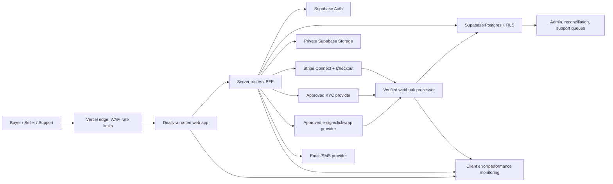

# Target system architecture

## 1. Architecture decision

Dealivra will evolve from the current Vite single-page prototype into a routed web application with a server boundary for authentication-sensitive and privileged operations.

The migration must be incremental:

- Public marketing, policies, verification pages, and share previews become server-rendered or statically generated routes.
- The authenticated Deal Workspace remains React, separated into feature modules.
- Sessions move toward `HttpOnly`, `Secure`, appropriately scoped cookies through an approved server authentication integration.
- All money, identity, administrator, evidence-signing, and state-transition actions execute server-side.
- Supabase remains the system of record for application data, authorization, storage metadata, and audit events.
- Stripe remains the proposed US payment provider for the controlled beta.

This approach improves routing, SEO, security headers, session control, and production observability without rewriting every screen at once.

## 2. Logical components



## 3. Trust boundaries

| Boundary | Untrusted input | Required controls |
|---|---|---|
| Browser to Dealivra | All fields, URLs, files, tokens, and action requests | Schema validation, CSRF strategy, session check, rate limit, authorization, output encoding |
| Dealivra to Supabase | User identity and requested record | Least privilege, RLS, explicit grants, server-only service role |
| Dealivra to Stripe/KYC/e-sign | Provider IDs, amounts, redirect state | Server secrets, allowlisted callback URLs, idempotency, correlation IDs |
| Provider webhook to Dealivra | Signed event body | Raw-body signature verification, timestamp tolerance, atomic deduplication, state-transition validation |
| Storage upload | File bytes and metadata | MIME/extension validation, size limits, malware scan, private bucket, signed access, metadata stripping |
| Admin interface | High-impact commands | Separate role, phishing-resistant MFA, step-up auth, reason, dual control for selected actions, audit |

The browser is never trusted because it displays a valid screen or because it previously fetched a record.

## 4. Application module target

```text
src/
  app/
    routes/
    providers/
    error-boundaries/
  features/
    auth/
    deals/
    agreements/
    payments/
    delivery/
    evidence/
    disputes/
    trust/
    admin/
  components/
    primitives/
    patterns/
  services/
    api/
    telemetry/
  design-system/
    tokens/
    components/
  test/
```

Feature modules own their view, state, schemas, API adapter, tests, and analytics events. Shared components do not import feature code.

## 5. Server responsibilities

The server or Supabase Edge Function must exclusively perform:

- Account linking, session revocation, and privileged profile changes.
- Deal publication and material agreement-version creation.
- Buyer claim/acceptance transition.
- Provider onboarding and callback processing.
- Checkout creation and fee calculation.
- Payment, payout, refund, dispute, and transfer state changes.
- Signed URL issuance for private evidence.
- Administrator moderation and support commands.
- Notifications based on committed state.

The client may optimistically update presentation, but final state must come from the server.

## 6. Data and event model

### Source of truth

- Postgres: deals, participants, agreement versions, acceptances, evidence metadata, cases, operational state.
- Stripe: card/bank credentials, payment intent, charge, refund, dispute, transfer, payout truth.
- KYC provider: identity document and biometric truth.
- Storage: private evidence objects; Postgres stores authorized metadata and hashes.
- Audit stream: who requested or caused every material state change and the provider correlation ID.

### Material events

Every event includes:

- Stable event ID.
- Deal ID and relevant provider ID.
- Actor type and actor ID when applicable.
- Previous and next state.
- Request/correlation ID.
- Reason code.
- Timestamp from Dealivra and provider.
- Safe metadata without secrets or unnecessary personal data.

Audit records are append-only for ordinary application roles.

## 7. Environment architecture

| Environment | Data | Providers | Access |
|---|---|---|---|
| Local | Generated fixtures only | Mocks/Sandbox | Developers |
| Preview | Generated or anonymized fixtures | Sandbox | Vercel-protected reviewers |
| Staging | Synthetic test identities and transactions | Dedicated provider sandbox | Team + approved testers |
| Production | Real users and controlled live transactions | Live approved providers | Least-privilege production roles |

Rules:

- No production database is copied to preview.
- Preview deployments cannot access production secrets.
- Staging and production use separate Supabase projects, provider keys, webhooks, storage, and email domains.
- Production changes originate from reviewed migrations and signed/reviewed code, not ad-hoc dashboard SQL.

## 8. Migration and schema delivery

The current collection of setup SQL files must become ordered, timestamped migrations.

Required pipeline:

1. Create an empty ephemeral database.
2. Apply every migration in order.
3. Load deterministic fixtures.
4. Run schema, function, storage, and RLS tests.
5. Test upgrade from the previous released schema.
6. Produce a migration plan and rollback/forward-fix decision.
7. Apply to staging before production.

Destructive migrations use expand/migrate/contract rather than immediate column/table removal.

## 9. Web and platform controls

Before public beta:

- Strict Content Security Policy with nonces/hashes where needed.
- HSTS after all domains are HTTPS-ready.
- `frame-ancestors`/clickjacking protection.
- `nosniff`, strict referrer policy, and a minimal permissions policy.
- Environment-specific caching; no private response in a public cache.
- Origin allowlist for API CORS. No production wildcard for authenticated APIs.
- Request/body/file size limits.
- WAF and rate limits by route, identity, IP signal, and high-risk action.
- Dependency, secret, and static application scans in CI.

## 10. Resilience and recovery

- Point-in-time database recovery for production.
- Separate backup policy for storage objects because database backups do not include all stored files.
- Provider event replay tools with idempotent processing.
- Dead-letter or failed-event queue visible to operations.
- Uptime and synthetic checks for sign-in, Deal Link, acceptance, and Checkout readiness.
- Quarterly restore drill during beta; documented evidence and corrective actions.
- Feature flags/kill switches for payment creation, release, new deals, uploads, and public sharing.

## 11. Architecture decisions still requiring external confirmation

- Final server framework and migration path after a one-week proof of concept.
- KYC vendor after pricing, coverage, false-positive, privacy, and contract review.
- E-sign/clickwrap provider and evidentiary standard after counsel review.
- SMS provider only if research proves SMS materially improves conversion or security.
- Carrier tracking provider after the initial carrier list is selected.

No vendor is considered approved because an adapter interface exists.

