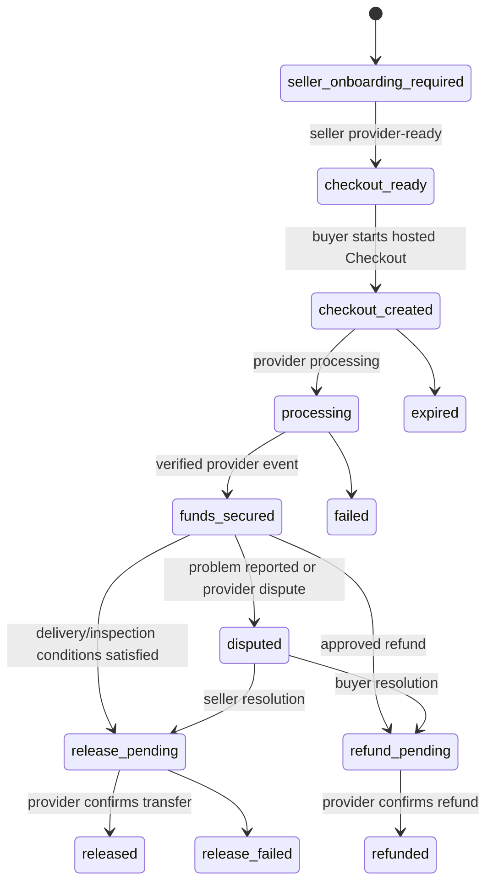

# Payments, KYC, release, and dispute operations

## 1. Product boundary

The customer-facing product is **Protected Payment**, subject to final counsel and provider approval. It is not described as legal escrow.

- Stripe or another licensed provider stores payment credentials and moves money.
- Dealivra stores transaction references and orchestrates approved workflow actions.
- The provider event and reconciliation record determine payment truth.
- Dealivra does not offer cash, crypto, gift cards, peer-to-peer payment apps, financing, or international payment in the initial release.

## 2. Participant verification

### Seller

Before receiving a protected payment, the seller must:

- Have a verified Dealivra email.
- Complete provider-hosted connected-account onboarding.
- Satisfy required payout and transfer capabilities.
- Complete additional identity/risk verification when the risk policy requires it.
- Pass category and transaction-limit checks.

### Buyer

The buyer must:

- Have a verified Dealivra email.
- Be the claimed participant on the accepted agreement.
- Complete provider payment authentication.
- Complete additional verification only where provider/risk/legal policy requires it.

Automated verification failures require a respectful remediation or manual-review path. A failed automated check is not displayed as an accusation.

## 3. Payment state machine

No client request directly sets `funds_secured`, `released`, or `refunded`.

## 4. Checkout controls

Before creating Checkout, the server revalidates:

- Environment is the expected Sandbox/live mode.
- Deal is accepted and the agreement version is current.
- Requester is the deal buyer.
- Seller is provider-ready.
- Item/category is permitted.
- USD amount is within approved limits.
- Fee calculation matches the published fee version.
- No conflicting payment exists.
- Risk rules do not require manual review.

Checkout uses an idempotency key bound to deal and agreement/fee version. A material deal change invalidates the prior checkout path.

## 5. Shipping flow and release conditions

1. Payment provider confirms funds state.
2. Seller completes required pre-shipment item and package evidence.
3. Seller enters a validated recipient address workflow and supported carrier/tracking number.
4. Carrier/tracking evidence confirms shipment.
5. Delivery is confirmed by the approved source.
6. Buyer completes the defined inspection/receipt action.
7. Dealivra marks release eligibility; the first private beta uses manual operational review.
8. Provider confirms release/transfer.

Seller instructions must clearly distinguish `processing` from `funds secured`. Shipment is disabled until the server considers payment and evidence requirements ready.

## 6. In-person handoff and release conditions

1. Funds state is confirmed.
2. Both parties agree to a public-location meeting.
3. Meeting details remain participant-private.
4. Buyer has an inspection opportunity.
5. Both parties complete the approved handoff confirmation/PIN flow.
6. A problem report blocks release when policy permits.
7. Operations approves release during the first beta.

The interface never recommends a home address by default and provides clear personal-safety guidance.

## 7. Refund and cancellation rules

A policy matrix must define:

- Who may request a cancellation at each state.
- Whether provider fees are refundable.
- Whether a transfer has occurred.
- Whether a transfer reversal is technically and contractually available.
- Who pays return shipping.
- Required evidence and deadlines.
- Administrator approval level.

All refund commands are server-side and include deal, payment, amount, currency, reason code, operator, case, idempotency key, and provider result.

Partial refunds remain disabled until the full-refund operation is proven and counsel approves the customer terms.

## 8. Dispute workflow

### User case states

`open` → `evidence_requested` → `under_review` → resolution (`resolved_buyer`, `resolved_seller`, `refunded`, or `cancelled`)

### Required case record

- Deal/agreement/payment identifiers.
- Who opened the case and stated reason.
- Release-block status.
- Evidence checklist and deadlines.
- Provider dispute/chargeback state.
- Every support message and operator action.
- Final decision, policy version, reason, amount, and provider confirmation.

### Operations rules

- One case owner at a time.
- No evidence downloaded outside the approved case workspace.
- No promise of outcome before review.
- Conflict-of-interest escalation.
- Higher approval for manual release, refund above threshold, or policy exception.
- Appeals process defined before broad launch.

Provider chargebacks and user Dealivra disputes are related but not identical; both must be visible in the case.

## 9. Reconciliation

At least daily, an automated job compares:

- Dealivra payment state.
- Stripe PaymentIntent/Charge/Refund/Dispute/Transfer state.
- Amount, currency, connected account, transfer group, and timestamps.
- Expected platform fee and seller amount.

Differences create a blocking operations exception. The system may automatically repair only explicitly approved safe discrepancies; financial state conflicts require review.

The launch gate requires every pilot transaction to reconcile.

## 10. Live-mode prerequisites

- Stripe approves the marketplace/platform use case and capabilities.
- Payments counsel approves funds flow, wording, terms, refunds, disputes, and fee presentation.
- Seller agreement, buyer terms, privacy, prohibited-items, refund/cancellation, and support policies are published.
- KYC and e-sign/clickwrap providers are contracted and tested.
- Payment event replay, concurrency, failure, ACH timing, refund, chargeback, account restriction, and payout failure tests pass.
- Reconciliation, alerts, case operations, and kill switches are live.
- Independent security assessment has no open critical/high findings.

